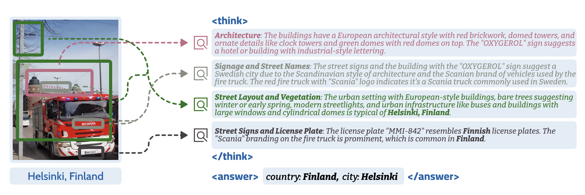

# GLOBE

Official implementation of the paper **"Recognition through Reasoning: Reinforcing Image Geo-localization with Large Vision-Language Models"**, NeurIPS 2025.

[](https://arxiv.org/abs/2506.14674) [](https://huggingface.co/datasets/globe-project/MP16-Reason) [](https://huggingface.co/globe-project/models) [](https://huggingface.co/spaces/globe-project/demo) [](LICENSE)



## 📖 Abstract

GLOBE is a framework that enhances image geo-localization by leveraging large vision-language models (LVLMs) through a reasoning-based approach. Our method combines visual recognition with reasoning to achieve state-of-the-art performance on benchmark datasets.

## 🚀 Quick Start

### Installation

```bash
# Clone repository
git clone https://github.com/lingli1996/GLOBE.git
cd GLOBE

# Install dependencies
pip install -r requirements_globe.txt
pip install -e .
```

### Inference & Evaluation

Download the pre-trained Globe model from HuggingFace:

```bash
# Download GLOBE models
# Qwen2.5-VL-7B backbone
git clone https://huggingface.co/globe-project/GLOBE-Qwen2.5VL-7B
# IntenVL3-VL-8B backbone
git clone https://huggingface.co/globe-project/GLOBE-InternVL3-8B
```

We recommend you deploying GLOBE with the vLLM framework for efficient inference, for example:

```bash
CUDA_VISIBLE_DEVICES=0 \
vllm serve GLOBE-Qwen2.5VL-7B \
    --trust-remote-code \
    --served-model-name qwen2.5-vl \
    --gpu-memory-utilization 0.95 \
    --host 0.0.0.0 \
    --port 8081 \
    --max-model-len 8096
```

#### Inference an example

Once the model is deployed, you can use the following script to inference an image:

```python
import os
import time
import base64
from openai import OpenAI

def infer_image(image_path, prompt, url="http://0.0.0.0:8081/v1", stream=False):
    openai_api_key = "EMPTY"
    client = OpenAI(
        api_key=openai_api_key,
        base_url=url,
    )
    with open(image_path, "rb") as f:
        encoded_image = base64.b64encode(f.read())
        encoded_image_text = encoded_image.decode("utf-8")
    base64_img = f"data:image;base64,{encoded_image_text}"

    start = time.time()
    chat_response = client.chat.completions.create(
        model="qwen2.5-vl",
        timeout=60,
        temperature=0.6,
        max_tokens=512,
        messages=[
            {"role": "system", "content": "You are a helpful assistant."},
            {
                "role": "user",
                "content": [
                    {"type": "image_url", "image_url": {"url": base64_img}},
                    {"type": "text", "text": prompt},
                ],
            },
        ],
        stream=stream
    )
    i = 0
    buffer = ""
    if stream:
        for chunk in chat_response:
            content = chunk.choices[0].delta.content
            buffer += content
            if i == 0:
                end = time.time()
                dura = end - start
                print(f"TTFT: {dura}s")
            i += 1
    
        final_end = time.time()
        dural = final_end - start
        print(f"TOTAL: {dural}s")
        print(f"TPOT: {(dural / i)}")
        return buffer
    else:
        final_end = time.time()
        dural = final_end - start
        print(f"TOTAL: {dural}s")
        return chat_response.choices[0].message.content

prompt_cot = "You are a geolocation expert. You are participating in a geolocation challenge. Based on the provided image:\n1. Carefully analyze the image for clues about its location (architecture, signage, vegetation, terrain, etc.)\n2. Think step-by-step about what country, and city this is likely to be in and why\n\nYour final answer include these two lines somewhere in your response:\ncountry: [country name]\ncity: [city name]\n\nYou MUST output the thinking process in <think> </think> and give answer in <answer> </answer> tags."

output = infer_image("/path/to/7e_c3_8163912402.jpg", prompt_cot, url="http://0.0.0.0:8081/v1")
print(output)
```

For batch inference on a dataset, please refer to `examples/train/grpo/globe/eval.py`.

#### Get results on MP16-Reason-Test dataset.

```shell
python eval.py \
    --url http://0.0.0.0:8081/v1 \
    --output globe-qwen2.5vl-7b-mp16-reason-test-12k.csv \
    --dataset mp16-reason-test-12k \
    --use_cot
```

#### Get results on img2gps 3k dataset.

```shell
python eval.py \
    --url http://0.0.0.0:8081/v1 \
    --output globe-qwen2.5vl-7b-img2gps3k.csv \
    --dataset img2gps3k \
    --use_cot
```

## Training

### 1. GRPO Training

Globe provides multiple GRPO training configurations:

#### Using All Reward Functions

```bash
bash examples/train/grpo/globe/train_all_rewards.sh
```

- **Reward Functions**: globe_accuracy, globe_locatability, globe_visual_match
- **Weights**: 1.0, 0.2, 0.5

#### Using Single Reward Function

```bash
bash examples/train/grpo/globe/train_one_reward.sh
```

- **Reward Function**: globe_accuracy only

#### Using Two Reward Functions (*recommend*)

```bash
bash examples/train/grpo/globe/train_two_rewards.sh
```

- **Reward Functions**: globe_accuracy and globe_visual_match
- **Weights**: 1.0, 0.5

**General GRPO Configuration:**

- **Base Model**: Qwen2.5-VL-7B-Instruct
- **Dataset**:  `data/mp16-reason-train`
- **Learning Rate**: 1e-6
- **Training Epochs**: 1
- **Generation Parameters**: Temperature=1.0, Number of generations=16 or 24
- **Output Directory**: `experiments/globe_*_reward`

### 2. Supervised Fine-tuning (SFT) (optional)

Use the following script for supervised fine-tuning:

```bash
bash examples/train/grpo/globe/train_sft.sh
```

**Configuration Details:**

- **Base Model**: Qwen2.5-VL-7B-Instruct
- **Dataset**: `data/mp16-pro-train`
- **Learning Rate**: 1e-5
- **Training Epochs**: 2
- **Output Directory**: `experiments/sft_geoloc_reason`

### 3. Reward Model Training (RM) (optional)

Train the LLM reward model using:

```bash
bash examples/train/grpo/globe/train_rm.sh
```

**Configuration Details:**

- **Base Model**: Qwen2.5-VL-7B-Instruct
- **Dataset**: `data/geoloc_rm_20w`
- **Fine-tuning**: LoRA (rank=16, alpha=64)
- **Learning Rate**: 1e-4
- **Training Epochs**: 2
- **Output Directory**: `experiments/globe_rm_model`

### Hardware Requirements

| Training Type | Recommended GPUs | Memory per GPU |
|---------------|------------------|----------------|
| SFT Training  | 8 GPUs           | 40GB      |
| RM Training   | 8 GPUs           | 40GB      |
| GRPO Training | 8 GPUs           | 80GB      |

## 🧩 Code Structure

```
globe/
├── dataset.py              # Dataset definitions and data loading
├── plugin.py               # Reward function definitions for GRPO
├── train_sft.sh            # Supervised fine-tuning script
├── train_rm.sh             # Reward model training script
├── train_all_rewards.sh    # GRPO training with all reward functions
├── train_one_reward.sh     # GRPO training with single reward function
└── train_two_rewards.sh     # GRPO training with two reward functions
```


## 📄 Citation

If you use GLOBE in your research, please cite our paper:

```bibtex
@inproceedings{globe2025,
  title={Recognition through Reasoning: Reinforcing Image Geo-localization with Large Vision-Language Models},
  author={Li, Ling and Zhou, Yao and Liang, Yuxuan and Tsung, Fugee and Wei, Jiaheng},
  booktitle={Advances in Neural Information Processing Systems},
  year={2025}
}
```

## 🙏 Acknowledgement

Globe is built upon several excellent open-source projects and models:

- **[ms-swift](https://github.com/modelscope/ms-swift)**: ModelScope Swift for RL training
- **[Qwen2.5-VL](https://huggingface.co/collections/Qwen/qwen25-vl)** Qwen2.5-VL models
- **[MP16-pro dataset](https://huggingface.co/datasets/Jia-py/MP16-Pro)**: Geolocation dataset
- **[DeepSeek-R1](https://github.com/deepseek-ai/DeepSeek-R1)**: DeepSeek reasoning algorithm

We would like to thank their excellent work and inspiration for our research.
